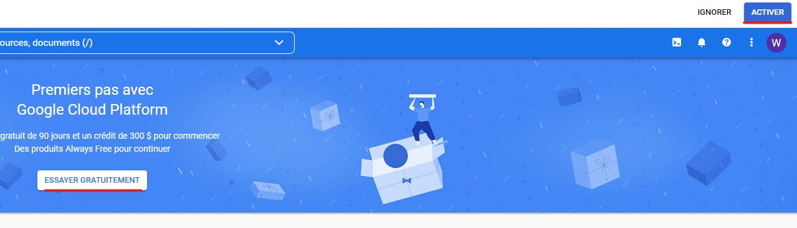

# Create a trash Gmail account and activate GCP trial period. 

1. Not much to say here, go to Gmail and create a new account.
1. Activate the GCP Trial
   - Access the [GCP Console](https://console.cloud.google.com/)
   - Ensure You have the right Gmail account selected  
    
   - Click activate and wait a few minutes
    

> /!\ **- At the end of the course remember to deactivate billing and remove payment method. [Link to instructions](chapters/deactivate-gcp-billing.md)** /!\

