# Table of Content
- [Table of Content](#table-of-content)
- [About this repo](#about-this-repo)
  - [Objectives of the exercise](#objectives-of-the-exercise)
  - [Useful Tools and preliminary steps](#useful-tools-and-preliminary-steps)
- [Part I : Infrastructure Deployment](#part-i--infrastructure-deployment)
  - [Create a trash Gmail account and activate GCP trial period.](#create-a-trash-gmail-account-and-activate-gcp-trial-period)
  - [Create a VM](#create-a-vm)
    - [Instantiate a VM](#instantiate-a-vm)
    - [The machine family, series and type](#the-machine-family-series-and-type)
    - [Configure the OS (Disque de démarrage)](#configure-the-os-disque-de-démarrage)
    - [Allow HTTP traffic](#allow-http-traffic)
    - [Handle SSH Access](#handle-ssh-access)
  - [Accessing the VM](#accessing-the-vm)
    - [Attach VS Code to your VM](#attach-vs-code-to-your-vm)
      - [Configure the SSH connection](#configure-the-ssh-connection)
  - [Preparing the VM](#preparing-the-vm)
    - [Install Docker](#install-docker)
    - [Post install operations](#post-install-operations)
    - [Start and enable Docker](#start-and-enable-docker)
    - [Add your user to the docker group](#add-your-user-to-the-docker-group)
    - [Install Git](#install-git)
    - [Install oh-my-zsh](#install-oh-my-zsh)
  - [Conclusion](#conclusion)
- [Troubleshooting](#troubleshooting)
  - [Manually allow HTTP traffic](#manually-allow-http-traffic)
- [Allow HTTP on a GCP VM](#allow-http-on-a-gcp-vm)
- [Post course operations](#post-course-operations)
  - [Deactivate GCP billing](#deactivate-gcp-billing)
  - [Remove credit card informations](#remove-credit-card-informations)

# About this repo

This repository contains the instructions to perform the course given in June 2022 at CESI Nanterre.

## Objectives of the exercise

The objective is to support the introduction to the Cloud Native concept by practicing high level cloud notions and interacting with a CSP (Cloud Service/Solution Provider)

The following tutorial will use GCP (Google Cloud Platform).

**We will deploy a simple micro-service multiple time on one cloud VM and have a reverse proxy load balancing between them.**

## Useful Tools and preliminary steps

I suggest using VS Code as a work environment during this TD as it is light weight and plenty of feature that ease our work.

I will be using Linux as a work environment through WSL, a way to have access to a linux kernel on a Windows session.
Feel free to use:
- A dual boot with linux os installed
- A VM on your Windows with VMWare Player or Virtual Box
- An already deployed Cloud VM
- Your own WSL installation
- A container running locally or in the cloud (kudos for that)

If you rather want to use Windows as a terminal and work environment, that's up to you. 

# Part I : Infrastructure Deployment

## Create a trash Gmail account and activate GCP trial period. 

First go to Gmail and create a new trash account.

Activate the GCP Trial  
  - Access the [GCP Console](https://console.cloud.google.com/)
  - If asked choose your country
  - Ensure You have the right Gmail account selected  
  
  - Click on "Essayer gratuitement" or "Activer" 
  - Select the right options 
  - Check your phone number
  - Fill your address
  - Fill your credit card number
  - Finish the form and activate the free trial

> /!\ **- At the end of the course remember to deactivate billing and remove payment method. [Link to instructions](chapters/deactivate-gcp-billing.md)** /!\

## [Create a VM](chapters/create-vm.md)

> Before using it you to activate the Compute Engine API service  

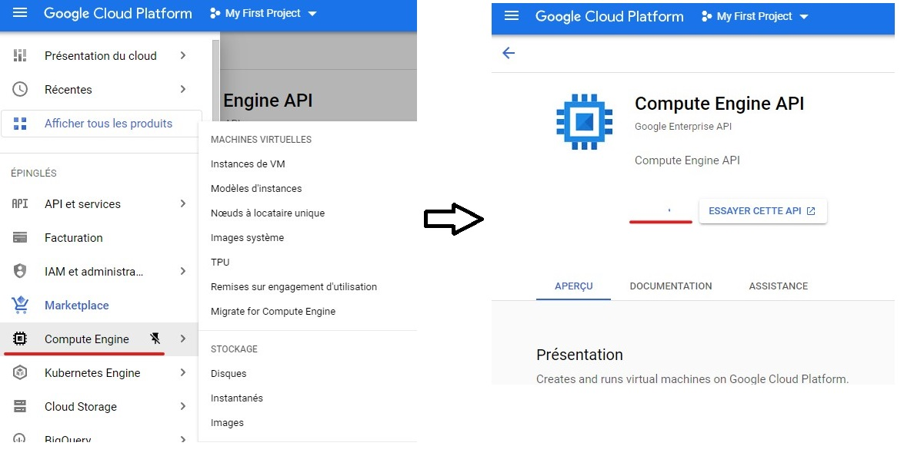

### Instantiate a VM

There is a lot of different options when creating a VM. We will keep it simple. 

Access the "Instance de VM" menu from the Compute Engine section 

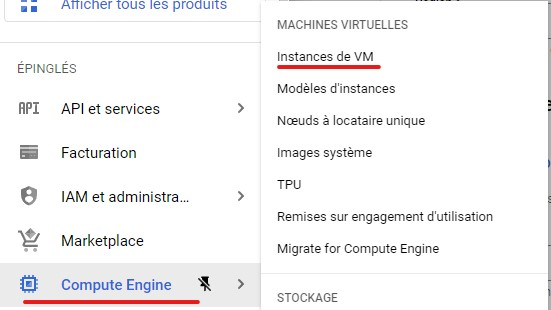

Feel free to review them all but here are the one we need to take a look at

### The machine family, series and type  

There is for family, one per main usage: 
1. General use for... any basic IT need.
2. Compute oriented : where you get more CPU than memory, that is for heavy computing operation like AI or complex mathematical operations. 
3. Memory oriented : for when caching a huge amount of data concurrently is a main aspect, like for big eCommerce platform.
4. GPU : Attach a GPU to the instance for heavy graphical computing can be hijacked for heavy normal compute as well in certain case.
   - The series is about the generation and brand of CPU embedded into the instance. E2 is the most standard one. 

> You can go from the cheapest option, the f1-micro of the N1 series that will cost you a few \$ per months (4/5\$) to the m2-megamem-416 that cost around **40 000$** a months.

Take an E2-medium if you don't feel adventurous.(an E2-micro will do the job for the course, even less).  

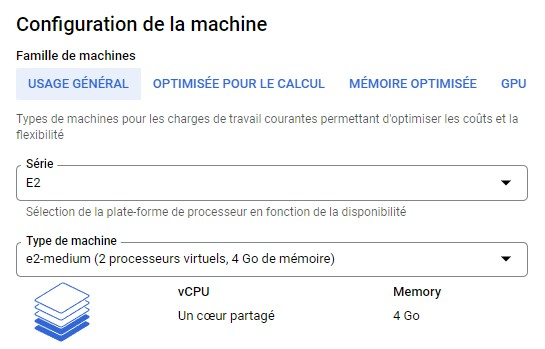

### Configure the OS (Disque de démarrage)

There is a small summary of the storage and OS settings in the "Disque de démarrage" section  

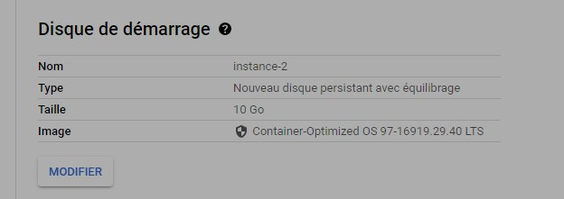

You can then modify it to choose the OS and size that fits your need

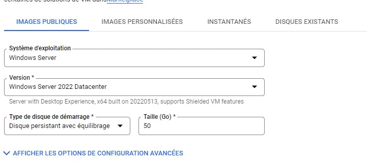
> This an excellent free way to give a try at the latest OS released (or specific ones)

>I will use CentOS7 by force of habits. But take the one you are the most comfortable with or one you want to try out.

### Allow HTTP traffic

GCP know that a majority of their customer come here to deploy web services which most generally use HTTP traffic on port 80 or HTTPS on port 443.
So there is an option to allow those two traffic directly from VM creation


> /!\ If you don't allow the traffic from here you'll need to configure it later through the Firewall section of GCP services, which is a really good exercise. here is [some instruction](#manually-allow-http-traffic) on how ot do it

### Handle SSH Access

You can add public keys to the instance from 3 different ways : 
- At the instance creation, there is a field to add Public key
- After the instance creation, you can modify it to add public key
- You can SSH to the VM through th GCP tools and then add the key to you `authorized_keys` file
  
> I generated one ed25519 ssh key pair and added it to the VM config :  
> `ssh-keygen -t ed25519 -C "neito"`

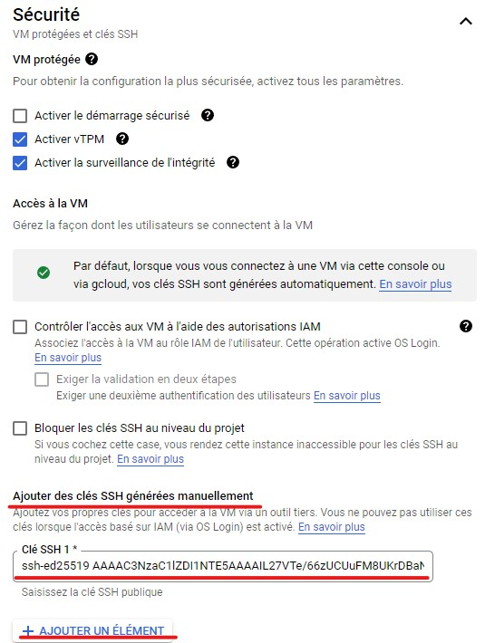

## Accessing the VM

GCP provide [more complex and supposedly secure ways](https://cloud.google.com/compute/docs/oslogin/set-up-oslogin) but we're going ot use standard SSH keys to interact with our VMs.  

To access the instance you need to get its public IP. It is displayed in the VM instances summary

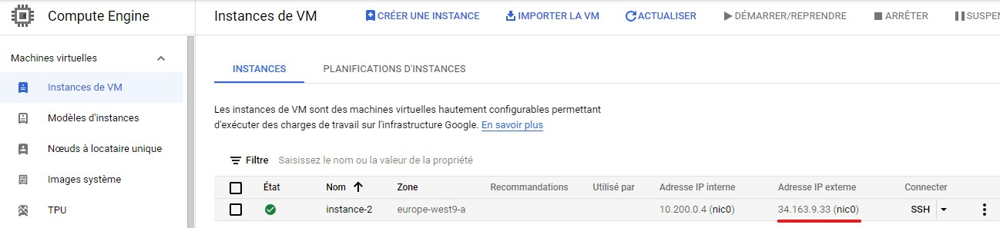

Then you need to connect using the private key + the user + the ip
```sh
# The format of the command to connect is the following : 
# ssh -i path/to/privatekey username@ipadress
# Example :
ssh -i ~/.ssh/cloud_key willem.houm@34.163.9.33 
```
> I specified the user when generated the key with the `-C` option

### Attach VS Code to your VM

This is extremely useful

First install the `Remote - SSH` Extensions from VS Code marketplace

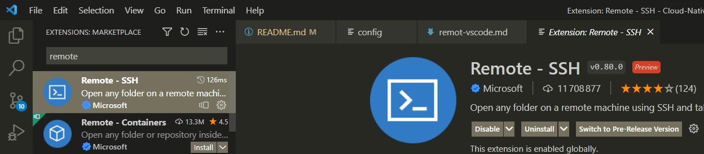

A new icon will appear in the left bar of VS Code

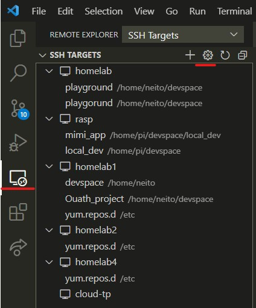

#### Configure the SSH connection

By clicking the setting cog you can choose to edit a SSH config file 

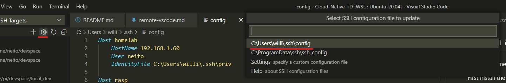

At the end of the file you need to add a section like this one 

```
Host cloud-tp # Here you can specify an alias for the connection
    Hostname 34.163.9.33 # The IP or FQDN (domain name) of the machine
    User willem.houm # The user name
    IdentityFile C:\Users\willi\.ssh\cloud_key # the absolute path to the SSH private key
```

> You can [find the IP address](accces-prepare-VM.md#accessing-the-vm) on the VM summary screen

There will be an entry for each section in the config file on the REmote - SSH menu

Find the one with the name you used, right-click and choose the option you prefer 

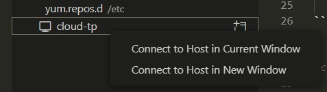

This will trigger the install process. 

> If it doesn't work i might have to uncomment the `AllowTcpForwarding yes` line on the `/etc/ssh/sshd_config` file of the VM and restart the sshd service with 
> ```
> sudo systemctl restart sshd
> ```

If everything works you should have a VS Code connected to your cloud instance
You can confirm it visually in the bottom-left corner of VS Code

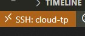

## Preparing the VM 

### Install Docker

Since Docker is available on many platform, please follow the instructions [from the official site](https://docs.docker.com/engine/install/) regarding the one you are using. 

> [example for CentOS](https://docs.docker.com/engine/install/centos/)
> ```
> sudo yum install -y yum-utils
> sudo yum-config-manager --add-repo https://download.docker.com/linux/centos/docker-ce.repo
> sudo yum install docker-ce docker-ce-cli containerd.io docker-compose-plugin
> ```

> Docker compose is now embedded with Docker as a internal plugin

### Post install operations

On Linux you'll need to add your user to the docker group (created during docker installation) in order to be able to interact with the installation

### Start and enable Docker

After the install docker might not be started, to start use the system control command relative to the system you're using 

> Example for CentOS 
> ```
> sudo systemctl start docker
> sudo systemctl enable docker
> ```

### Add your user to the docker group 

For your user to interact with the docker service you'll need to [add it to the docker group](https://docs.docker.com/engine/install/linux-postinstall/)

> Example for CentOS 
> ```
> sudo systemctl start docker
> sudo systemctl enable docker
> ```

### Install Git

Optional as well but required for oh-my-zsh. And can become handy if you want to share code.

On most linux distro you just to use the package manager there is a default git repo.

> Example for CentOS 
> ```
> sudo yum install git -y
> ```

### Install oh-my-zsh

This is optional, it's the most awesome shell to use for Linux

> Example for CentOS
> ```
> sudo apt install zsh
> sh -c "$(curl -fsSL https://raw.github.com/ohmyzsh/ohmyzsh/master/tools/install.sh)"
> ```

## Conclusion 

If you've done everything well you should able to do the following command : 

```sh
➜  ~ docker ps 
# And have te following output :
CONTAINER ID   IMAGE     COMMAND   CREATED   STATUS    PORTS     NAMES
```

# Troubleshooting

## Manually allow HTTP traffic

# Allow HTTP on a GCP VM

If you choose not to allow http traffic on VM creation you have to configure it through the VPC Network menu


you have here the list of firewall rules created for your project. Go ahead and create a new one.


#TODO 

# Post course operations

## Deactivate GCP billing

> [Here](https://cloud.google.com/billing/docs/how-to/modify-project?hl=fr#disable_billing_for_a_project) is the documentation to close billing on projects

1. Type "Gestion des comptes" in the search bar to directly access the right page
    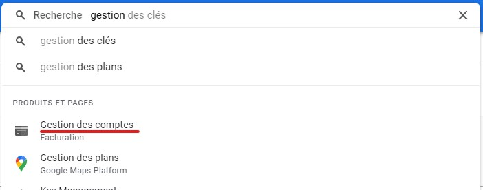
2. On the upper options bar you the "Fermer le compte de facturation" option
   - Follow the instruction and close billing  
   
    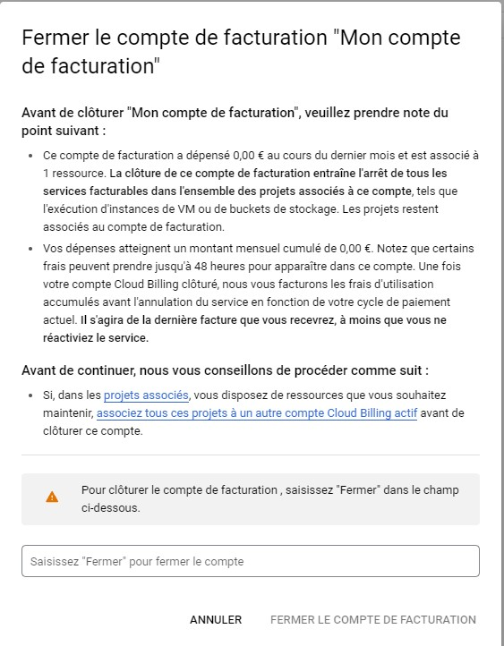

## Remove credit card informations

1. Type "mode de paiement" in the search bar to directly access the right page
   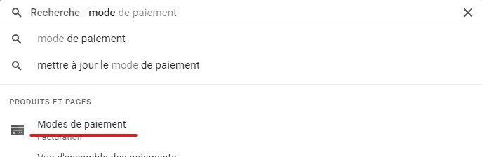
2. Locate your credit card delete it

