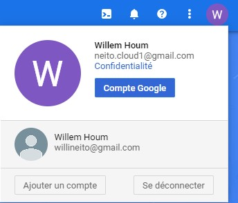

- [About this repo](#about-this-repo)
  - [Objectives of the exercise](#objectives-of-the-exercise)
- [Useful Tools and preliminary steps](#useful-tools-and-preliminary-steps)
  - [Create a trash Gmail account and activate GCP trial period.](#create-a-trash-gmail-account-and-activate-gcp-trial-period)
- [Preparing the infrastructure](#preparing-the-infrastructure)
  - [Create a VM](#create-a-vm)
  - [Access and prepare the VM](#access-and-prepare-the-vm)
    - [Attach VS Code to the VM](#attach-vs-code-to-the-vm)
    - [Allow HTTP traffic](#allow-http-traffic)
- [Post course operations](#post-course-operations)
  - [Deactivate GCP billing](#deactivate-gcp-billing)

# About this repo

This repository contains the instructions to perform the course given in June 2022 at CESI Nanterre.

## Objectives of the exercise

The objective is to support the introduction to the Cloud Native concept by practicing high level cloud notions and interacting with a CSP (Cloud Service/Solution Provider)

The following tutorial will use GCP (Google Cloud Platform).

**We will deploy a simple micro-service multiple time on one or more cloud VM and have a reverse proxy load balancing between them.**

# Useful Tools and preliminary steps

I suggest using VS Code as a work environment during this TD as it is light weight and plenty of feature that ease our work.

I will be using Linux as a work environment through WSL, a way to have access to a linux kernel on a Windows session.
Feel free to use:
- A dual boot with linux os installed
- A VM on your Windows with VMWare Player or Virtual Box
- An already deployed Cloud VM
- Your own WSL installation
- A container running locally or in the cloud (kudos for that)

If you rather want to use Windows as a terminal and work environment, that's up to you. 

## Create a trash Gmail account and activate GCP trial period. 

1. Not much to say here, go to Gmail and create a new account.
1. Activate the GCP Trial
   - Access the [GCP Console](https://console.cloud.google.com/)
   - Ensure You have the right Gmail account selected
    
   - Click activate and wait a few seconds
    

> /!\ **- At the end of the course remember to deactivate billing and remove payment method. [Link to instructions](chapters/deactivate-gcp-billing.md)** /!\

# Preparing the infrastructure

## [Create a VM](chapters/create-vm.md)

## [Access and prepare the VM](chapters/accces-prepare-VM.md)

### [Attach VS Code to the VM](chapters/remote-vscode.md)

### [Allow HTTP traffic](chapters/allow-http.md)

# Post course operations

## [Deactivate GCP billing](chapters/deactivate-gcp-billing.md)

