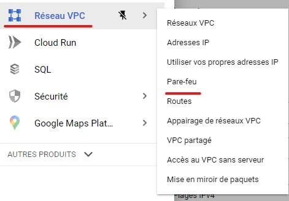
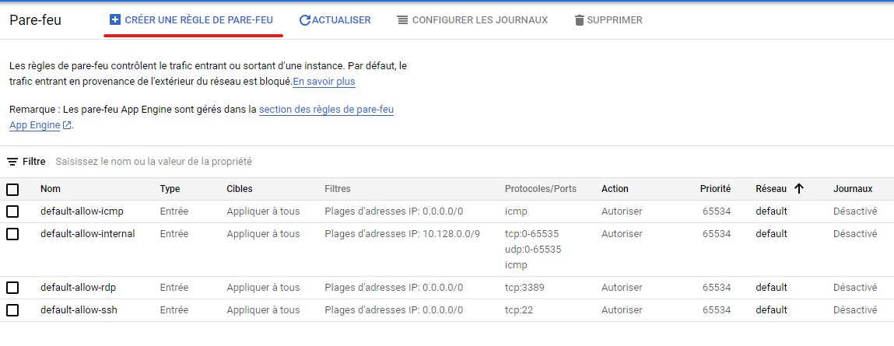

# Allow HTTP on a GCP VM

If you choose not to allow http traffic on VM creation you have to configure it through the VPC Network menu

you have here the list of firewall rules created for your project. Go ahead and create a new one.

