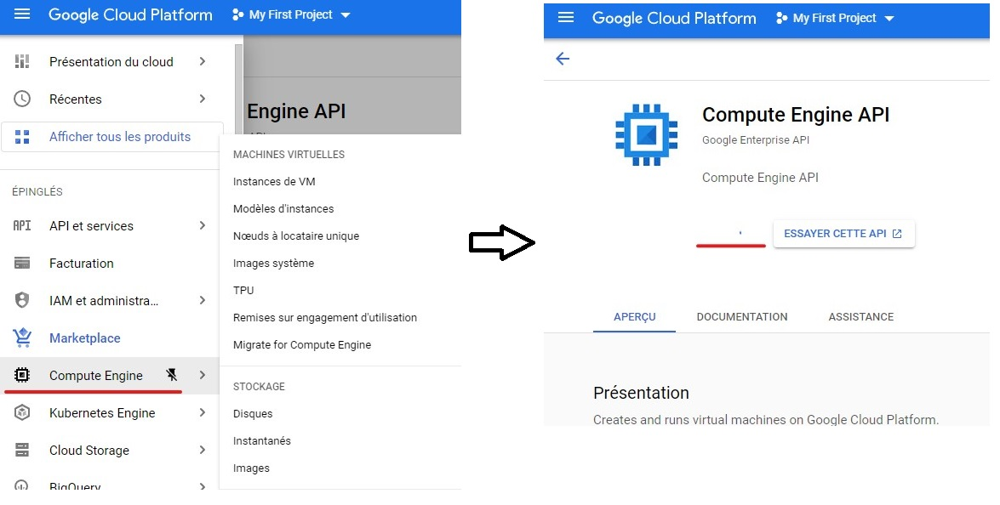
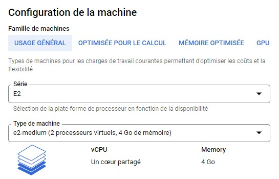
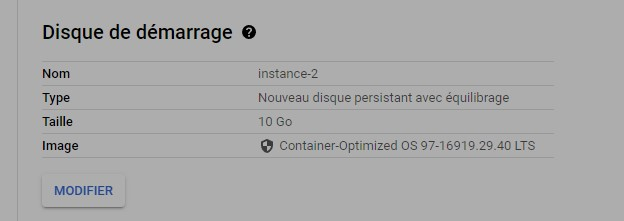
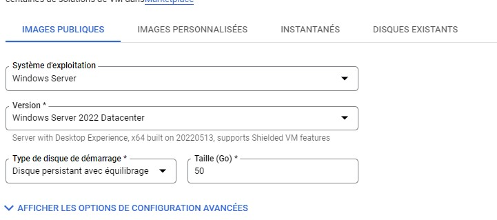

# Using Compute Engine API and create your VM

> Before using it you to activate the Compute Engine API service  

## Instantiate a VM

There is a lot of different options to create a VM. We will keep it simple. 

Access the "Instance de VM"  

## VM Options

Feel free to review them all but here are the one we need to take a look at

### The machine family, series and type  

There is for family, one per main usage: 
1. General use for... any basic IT need.
2. Compute oriented : where you get more CPU than memory, that is for heavy computing operation like AI or complex mathematical operations. 
3. Memory oriented : for when caching a huge amount of data concurrently is a main aspect, like for big eCommerce platform.
4. GPU : Attach a GPU to the instance for heavy graphical computing can be hijacked for heavy normal compute as well in certain case.
   - The series is about the generation and brand of CPU embedded into the instance. E2 is the most standard one. 

> You can go from the cheapest option, the f1-micro of the N1 series that will cost you a few \$ per months (4/5\$) to the m2-megamem-416 that cost around **40 000$** a months.

Take an E2-medium if you don't feel adventurous.(an E2-micro will do the job for the course, even less).  

### Configure the OS (Disque de démarrage)

There is a small summary of the storage and OS settings in the "Disque de démarrage" section  

You can then modify it to choose the OS and size that fits your need

> This an excellent free way to give a try at the latest OS released (or specific ones)

>I will use CentOS7 by force of habits. But take the one you are the most comfortable with or one you want to try out.

### Allow HTTP traffic

GCP know that a majority of their customer come here to deploy web services which most generally use HTTP traffic on port 80 or HTTPS on port 443.
So there is an option to allow those two traffic directly from VM creation

> /!\ If you don't allow the traffic from here you'll need to configure it later through the Firewall section of GCP services, which is a really good exercise. here is [some instruction](allow-http.md) on how ot do it

### Handle SSH Access

You can add public keys to the instance from 3 different ways : 
- At the instance creation, there is a field to add Public key
- After the instance creation, you can modify it to add public key
- You can SSH to the VM through th GCP tools and then add the key to you `authorized_keys` file
  
> I generated one ed25519 ssh key pair and added it to the VM config :  
> `ssh-keygen -t ed25519 -C "neito"`

