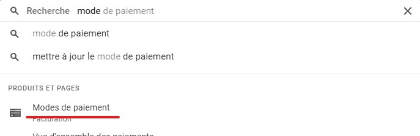

# Deactivate GCP Billing and remove payment method

## Deactivate Billing

> [Here](https://cloud.google.com/billing/docs/how-to/modify-project?hl=fr#disable_billing_for_a_project) is the documentation to close billing on projects

1. Type "Gestion des comptes" in the search bar to directly access the right page
    
2. On the upper options bar you the "Fermer le compte de facturation" option
   - Follow the instruction and close billing  
   
    

## Remove credit card informations

1. Type "mode de paiement" in the search bar to directly access the right page
   
2. Locate your credit card delete it