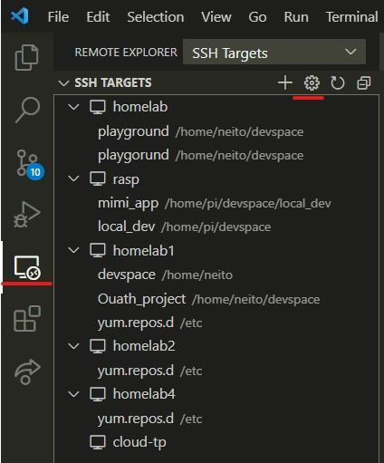
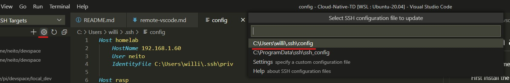
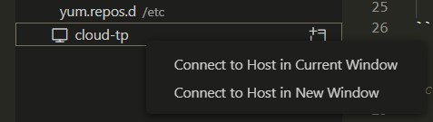

# Attach a VSCode instance to your VM

This is extremely useful

First install the `Remote - SSH` Extensions from VS Code marketplace


A new icon will appear in the left bar of VS Code



# Configure the SSH connection

By clicking the setting cog you can choose to edit a SSH config file 



At the end of the file you need to add a section like this one 

```
Host cloud-tp # Here you can specify an alias for the connection
    Hostname 34.163.9.33 # The IP or FQDN (domain name) of the machine
    User willem.houm # The user name
    IdentityFile C:\Users\willi\.ssh\cloud_key # the absolute path to the SSH private key
```

> You can [find the IP address](accces-prepare-VM.md#accessing-the-vm) on the VM summary screen

There will be an entry for each section in the config file on the REmote - SSH menu

Find the one with the name you used, right-click and choose the option you prefer 



This will trigger the install process. 

> If it doesn't work i might have to uncomment the `AllowTcpForwarding yes` line on the `/etc/ssh/sshd_config` file of the VM and restart the sshd service with 
> ```
> sudo systemctl restart sshd
> ```

If everything works you should have a VS Code connected to your cloud instance
You can confirm it visually in the bottom-left corner of VS Code


